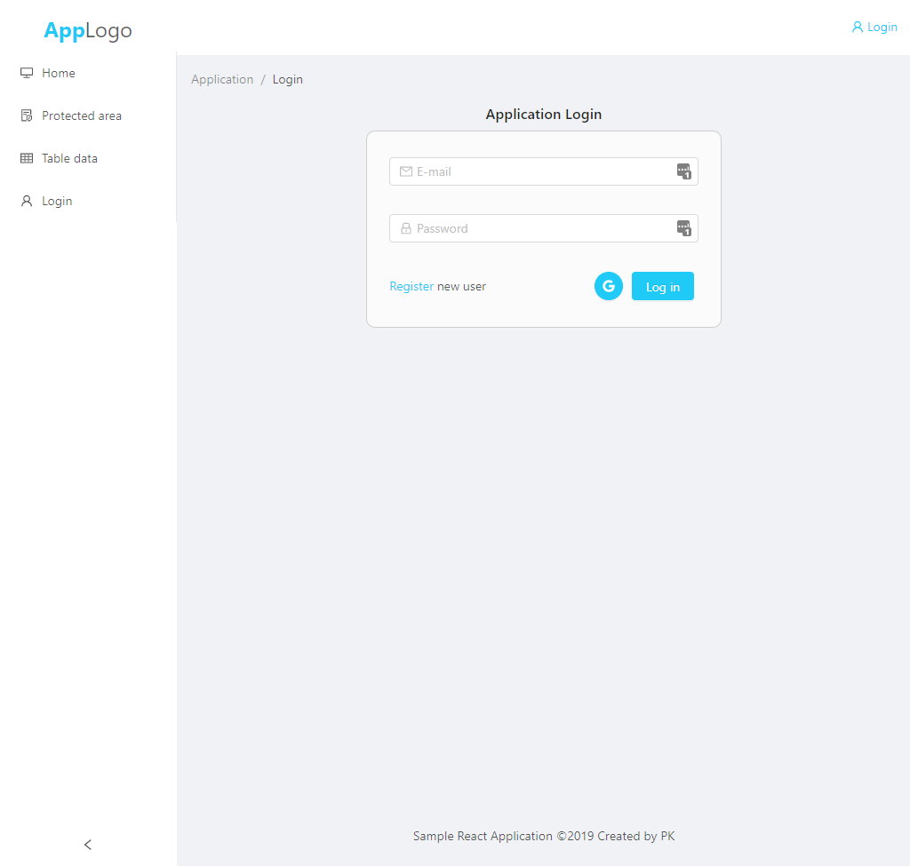
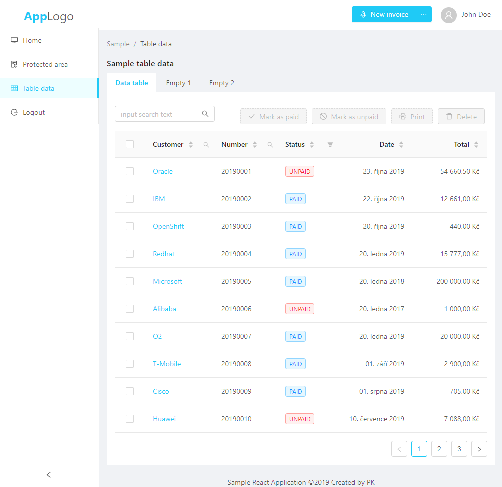

# Boilerplate for React / Node.js / ArangoDB / Docker application 
This project was created just to test possibilities in contemporary WEB technologies and libraries (React, Node.js, ArangoDB, Docker, JWT, Ant design, Axios, Redux, ...). 

This repository can be easily used as starting point (boilerplate) for project building on these commonly used technologies without starting hustle. Many troubles have been solved and commonly used components and strategies have been implemented. 

Just download repository and start your new project.   

## Screenshots




## Technologies used (modules)

### NoSQL DB
* [ArangoDB](https://www.arangodb.com/)
    * perfect match for great open source NoSQL DB solution, provides developer with mixed possibilities to use Document storage / Graph database / Search engine 

### Backend (API)
* [Node.js](https://nodejs.org/)
    * [Express](https://expressjs.com) (Rest API to JWT and Arango AQL)
    * [bcryptjs](https://github.com/dcodeIO/bcrypt.js) (library to crypto operations - store password in hash)
    * [dotenv](https://github.com/motdotla/dotenv) (Loads environment variables from .env for nodejs projects)
    * [jsonwebtoken](https://github.com/auth0/node-jsonwebtoken) (JsonWebToken implementation for node.js)

### Frontend
* [React](https://reactjs.org/) (A JavaScript library for building user interfaces)
    * [react-app-rewired](https://github.com/timarney/react-app-rewired) (just to be able to use LESS with Ant design / theming)
    * [Ant design](https://ant.design) (nice and clear web components and layout solution)
    * [Axios](https://github.com/axios/axios) (Promise based HTTP client, more universal then fetch)
    * [react-highlight-words](https://github.com/bvaughn/react-highlight-words) (react component to highlight words within text used to highlight text in data table after searching for phrase)
    * [react-redux](https://github.com/reduxjs/react-redux) (global storage for react state, used for authentication data throughout the app)
    * react-router (declarative routing for React)
    * [protected-routes](https://tylermcginnis.com/react-router-protected-routes-authentication/) (auth protected routes in react)
    * Login with Google account (alternative login method next to pure application login for registered users)
    
###Container (startup process)
Application is containerized with [Docker](https://www.docker.com/) and can be started just with `docker-compose` command:
```
docker-compose build
docker-compose up
```

Enter your docker IP with port 3000 to start WEB interface:
```
http://docker.local:3000
```

Each module can be started separately either with `docker-compose`:
```
docker-compose up arangodb
```

or `docker` itself: 
```
cd frontend
./docker-run.bat
```

### Notes
Docker configs are done on Windows platform with downfalls that comes with this setup (Docker toolbox). Correct the `docker-compose.yml` with appropriate paths in volumes (replace absolute paths with relative):
```
...
volumes:
      - '//C/private/sample/api:/app'
...
``` 
to:
```
...
volumes:
      - './api:/app'
...
```
